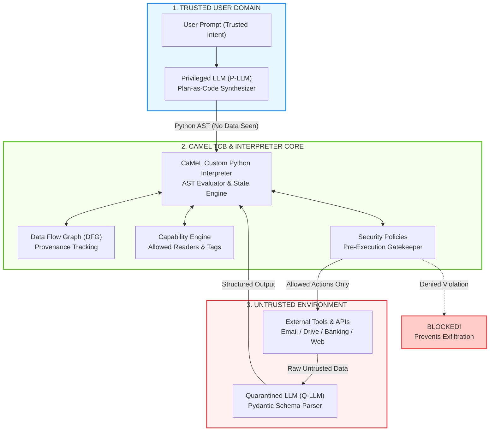

# CaMeL: Defeating Prompt Injections by Design
### A Comprehensive Architectural Deep Dive & Reading Guide

[](https://arxiv.org/abs/2503.18813)
[](https://github.com/google-research/camel-prompt-injection)
[](LICENSE)
[]()

---

## 🌟 Overview

This repository provides an in-depth, systematic breakdown of the seminal paper:  
**["CaMeL: Defeating Prompt Injections by Design"](https://arxiv.org/abs/2503.18813)**  
*Edoardo Debenedetti, Ilia Shumailov, Javier Rando, Florian Tramèr, Nicolas Carlini*  
**Google DeepMind, ETH Zurich, University of Toronto, Vector Institute (2025)**

While Large Language Models (LLMs) are rapidly evolving into autonomous agents equipped with APIs and tools, they are plagued by a fundamental security flaw: **Indirect Prompt Injection**. Prior defense attempts (delimiters, prompt sandwiching, instruction hierarchy, adversarial fine-tuning) rely on probabilistic model behavior and consistently crumble under adaptive attacks.

**CaMeL** (**Ca**pabilities for **M**achin**e** **L**earning) introduces a profound paradigm shift: **Security Engineering for AI**. Instead of trying to fix the neural network weights, CaMeL constructs a rigorous, mathematically provable system-level protective layer around untrusted models, borrowing foundational concepts from computer security: **Control Flow Integrity (CFI)**, **Information Flow Control (IFC)**, and **Capability-Based Access Control**.

---

## 📊 Interactive Archify Visualizations

We provide standalone, interactive architecture and workflow diagrams rendered with the `archify` engine, featuring dark/light modes, trace motion, responsive pan/zoom, and guided views:

- 🏛️ **[Interactive System Architecture & Trust Boundaries](visualizations/camel-architecture.html)**  
  *Explore the three trust domains: Trusted User Domain (P-LLM), the CaMeL TCB Mediation Core (Interpreter, DFG Tracker, Capability Store, Policy Gate), and the Untrusted Environment (Q-LLM, External Tools).*
- 🔄 **[Interactive Agent Security Workflow](visualizations/camel-workflow.html)**  
  *Trace step-by-step how a user request turns into Plan-as-Code, passes through the Capability Gate, and is either executed or safely blocked upon policy violation.*

---

## ⚡ The CaMeL Architecture in 3 Minutes



1. **Dual-LLM Separation:**
   - **Privileged LLM (P-LLM):** Only observes trusted user instructions. It translates intent into a restricted Python program (Plan-as-Code). It **never touches runtime tool outputs**, guaranteeing that control flow cannot be hijacked by injected prompts.
   - **Quarantined LLM (Q-LLM):** Completely stripped of tool-calling abilities. It functions purely as a parser that extracts structured fields (`Pydantic BaseModel`) from unstructured environment text.
2. **Capability-Based Tracking:**
   - Every value in memory is tagged with **Provenance** (`User`, `CaMeL`, `Tool`, `Inner Source`) and **Allowed Readers** (`Public` or specific user identities).
3. **Security Policy Interception:**
   - Before any state-mutating tool runs (e.g., `send_email` or `send_money`), the custom interpreter traverses the Data Flow Graph. If private or untrusted data is routed to an unauthorized recipient, the action is blocked immediately.

---

## 🗺️ Reading Roadmap

```mermaid
flowchart LR
    subgraph Part1["Part I: Foundations"]
        C0["00. System Security Paradigm"]
        C1["01. Limits of Dual-LLM"]
        C2["02. PI-SEC Security Game"]
        C0 --> C1 --> C2
    end

    subgraph Part2["Part II: Core Architecture"]
        C3["03. Architecture & Dual-LLM"]
        C4["04. Custom Interpreter"]
        C5["05. Capabilities & Policies"]
        C6["06. DFG: NORMAL vs STRICT"]
        C2 --> C3 --> C4 --> C5 --> C6
    end

    subgraph Part3["Part III: Audits & Horizon"]
        C7["07. AgentDojo Benchmarks"]
        C8["08. Side-Channel Attacks"]
        C9["09. Rogue User & Spy Tool"]
        C10["10. Discussion & Future"]
        C6 --> C7 --> C8 --> C9 --> C10
    end

    style Part1 fill:#f0f7ff,stroke:#0066cc,stroke-width:2px
    style Part2 fill:#f6ffed,stroke:#52c41a,stroke-width:2px
    style Part3 fill:#fff7e6,stroke:#fa8c16,stroke-width:2px
```



---

## 📚 Detailed Chapter Directory (Vietnamese Deep Dive)

The complete chapter series in [`docs/`](docs/) is written in clear, pedagogical Vietnamese, complete with exact paper mathematics, architectural diagrams, AST code snippets, and benchmark breakdowns:

| Chapter | Title | Key Themes & Insights |
| :---: | :--- | :--- |
| **[00](docs/00_tong_quan_va_triet_ly_thiet_ke.md)** | **Big Picture & System-Level Philosophy** | The rise of LLM agents, Von Neumann flat token vulnerability, failure of delimiters/sandwiching/fine-tuning, and the *Security by Design* paradigm. |
| **[01](docs/01_gioi_han_phong_thu_va_mo_hinh_willison.md)** | **Dual-LLM Limits & Data Flow Exploits** | Simon Willison's Dual-LLM model, why isolating control flow is not enough, parameter poisoning, and the SQL injection analogy. |
| **[02](docs/02_mo_hinh_an_ninh_tro_choi_pi_sec.md)** | **The PI-SEC Security Game Formalization** | State memory ($mem$), execution trace ($Trace$), allowable actions space ($\Omega_{prompt}$), adversary win conditions, and why static enumeration is impossible. |
| **[03](docs/03_kien_truc_camel_va_phan_tach_luong.md)** | **CaMeL Core Architecture & Flow Separation** | The 6 pillars, P-LLM Plan-as-Code generation, Q-LLM schema extraction, the `have_enough_information` boolean flag, and asymmetric model deployment. |
| **[04](docs/04_bo_thong_dich_python_noi_bo.md)** | **Inside the Custom Python AST Interpreter** | Restricted Python dialect, recursive AST evaluation, the 10-turn error recovery loop, and safety-critical **Error Redaction**. |
| **[05](docs/05_capabilities_va_chinh_sach_an_ninh.md)** | **Capabilities & Security Policies** | Metadata design (Provenance & Allowed Readers), lessons from libcap/Capsicum/CHERI, and concrete policies for Calendar, Banking, and Drive. |
| **[06](docs/06_do_thi_luong_du_lieu_normal_vs_strict.md)** | **Data Flow Graph: NORMAL vs. STRICT Mode** | Recursive dependency propagation ($c = a + b$), handling branching (`if/for`), over-tainting vs. side-channel protection trade-offs. |
| **[07](docs/07_thuc_nghiem_va_ket_qua_agentdojo.md)** | **AgentDojo Benchmark Evaluation** | Utility analysis ($77\%$ vs $84\%$), why Travel suite utility surged with newer reasoning models, $0\%$ ASR results, and token overhead analysis ($2.8\times$). |
| **[08](docs/08_phan_tich_kenh_phu_va_cac_don_tan_cong_nang_cao.md)** | **Side-Channel Attacks & Weaponization** | Weaponizing data flow into control flow, indirect resource inference, 1-bit exception leaks, timing channels, and functional error handling (`Result`/`Either`). |
| **[09](docs/09_kich_ban_mo_rong_rogue_user_va_spy_tool.md)** | **Extended Threats: Rogue User & Spy Tool** | Addressing enterprise insider threats ($44\%$ of breaches): Defending against malicious plugins (External Spy Tools) and compromised accounts (Rogue Users). |
| **[10](docs/10_thao_luan_gioi_han_va_tuong_lai.md)** | **Discussion, Human Factors & Future Horizon** | De-classification and user fatigue, parallels to CFI/ROP, migrating to typed functional languages (Rust/Haskell), and formal verification. |

---

## 📈 Key Benchmark Findings on AgentDojo

On the AgentDojo benchmark suite (Workspace, Banking, Slack, Travel):

```
Attack Success Rate (ASR) Comparison:
Undefended (Native API)  ████████████████████ 300 / 276 / 88 attacks succeeded
With CaMeL Defense       ▎ 0 attacks succeeded (Provable Safety)

Benign Task Utility:
Undefended Baseline      ████████████████ 84% completed
With CaMeL Defense       ███████████████  77% completed (Minimal drop)
```

- **Zero-Day Resilience:** While probabilistic instruction hierarchy in GPT-4o-mini still fails against 276 adaptive attacks, CaMeL brings successful attacks down to **zero** by construction.
- **Asymmetric Cost Savings:** Pairing a high-end planner (**Claude 4 Sonnet**) with a lightweight, cheap quarantined parser (**Claude 3.5 Haiku**) reduces median task cost by **$12\%$** with only a negligible $1\%$ impact on utility.

---

## 📂 Repository Structure

```text
camel-paper-deep-dive/
├── README.md                      # English master guide & reading roadmap
├── LICENSE                        # MIT License
├── visualizations/                # Standalone interactive HTML diagrams
│   ├── camel-architecture.html    # Interactive system architecture & boundaries
│   ├── camel-architecture.json    # Archify specification for architecture
│   ├── camel-workflow.html        # Interactive agent execution workflow
│   └── camel-workflow.json        # Archify specification for workflow
└── docs/                          # Complete 10-chapter Vietnamese deep-dive series
    ├── 00_tong_quan_va_triet_ly_thiet_ke.md
    ├── 01_gioi_han_phong_thu_va_mo_hinh_willison.md
    ├── 02_mo_hinh_an_ninh_tro_choi_pi_sec.md
    ├── 03_kien_truc_camel_va_phan_tach_luong.md
    ├── 04_bo_thong_dich_python_noi_bo.md
    ├── 05_capabilities_va_chinh_sach_an_ninh.md
    ├── 06_do_thi_luong_du_lieu_normal_vs_strict.md
    ├── 07_thuc_nghiem_va_ket_qua_agentdojo.md
    ├── 08_phan_tich_kenh_phu_va_cac_don_tan_cong_nang_cao.md
    ├── 09_kich_ban_mo_rong_rogue_user_va_spy_tool.md
    └── 10_thao_luan_gioi_han_va_tuong_lai.md
```

---

## 🔗 References & Official Resources

- **Original Paper:** [arXiv:2503.18813v2](https://arxiv.org/abs/2503.18813) — *Defeating Prompt Injections by Design* (Debenedetti et al., 2025).
- **Official Open-Source Repository:** [google-research/camel-prompt-injection](https://github.com/google-research/camel-prompt-injection).
- **Benchmark Suite:** [AgentDojo: A Dynamic Environment to Benchmark Attacks and Defenses for LLM Agents](https://github.com/dedis/agent-dojo).
