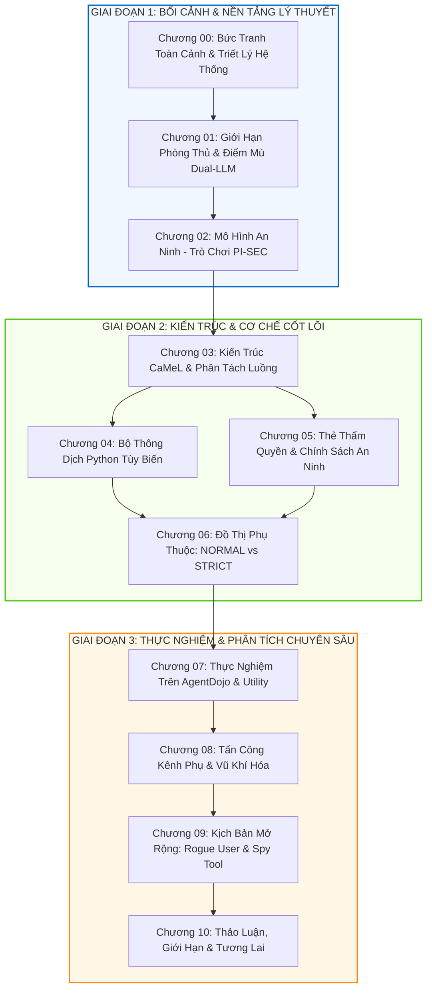

# CaMeL Paper Deep Dive: Defeating Prompt Injections by Design
## Chuỗi Chuyên Đề Đọc Hiểu Toàn Diện Paper CaMeL Bằng Tiếng Việt

- **Bài báo gốc tham chiếu:** [arXiv:2503.18813v2](https://arxiv.org/abs/2503.18813) (*Defeating Prompt Injections by Design*)
- **Tác giả bài báo:** Edoardo Debenedetti, Ilia Shumailov, Javier Rando, Florian Tramèr, Nicolas Carlini (Google DeepMind, ETH Zurich, University of Toronto, Vector Institute)
- **Mã nguồn chính thức:** [google-research/camel-prompt-injection](https://github.com/google-research/camel-prompt-injection)

---

## 📌 Giới Thiệu Chuỗi Chuyên Đề

Repository này là chuỗi tài liệu **nghiên cứu, phân tích và giải mã chuyên sâu bằng Tiếng Việt** về bài báo khoa học mang tính bước ngoặt:  
**"CaMeL: Defeating Prompt Injections by Design"** (Debenedetti et al., 2025 - Hợp tác nghiên cứu giữa **Google DeepMind, ETH Zurich, University of Toronto và Vector Institute**).

Khi các Mô hình Ngôn ngữ Lớn (LLMs) được trao quyền hành động (Agentic Systems) để tự động gọi API, đọc email, duyệt web và truy xuất cơ sở dữ liệu, chúng ngay lập tức đối mặt với **hiểm họa an ninh số 1: Tấn công Tiêm Lệnh Gián Tiếp (Indirect Prompt Injection)**. Các phương pháp phòng thủ truyền thống (như tinh chỉnh mô hình, dùng prompt phân cách, hay bộ lọc từ khóa) đều mang tính xác suất (heuristic) và liên tục bị qua mặt.

**CaMeL** (**Ca**pabilities for **M**achin**e** **L**earning) mang đến một cuộc cách mạng tư duy: **Chuyển dịch trọng tâm an ninh từ việc cố gắng uốn nắn mô hình (Model Scaffolding/Alignment) sang thiết kế kiến trúc hệ thống phần mềm có bảo chứng an toàn (System-level Security by Design)**.

Chuỗi tài liệu này được biên soạn tỉ mỉ, bám sát từng trang của công trình gốc, kết hợp với phân tích mã nguồn thực tế, các biểu đồ vector Mermaid trực quan, nhằm giúp học viên cao học, kỹ sư an ninh thông tin và các nhà phát triển hệ thống Agent nắm vững bản chất kỹ thuật từ lý thuyết đến triển khai.

---

## 🗺️ Bản Đồ Lộ Trình Đọc Hiểu (Reading Roadmap)

---

## 📚 Mục Lục Chi Tiết Các Chương

| Chương | Tên Chuyên Đề | Nội Dung Trọng Tâm |
| :---: | :--- | :--- |
| **[00](docs/00_tong_quan_va_triet_ly_thiet_ke.md)** | **Bức Tranh Toàn Cảnh & Triết Lý Phòng Thủ** | Sự bùng nổ của LLM Agent, hiểm họa Prompt Injection, sự sụp đổ của các bộ lọc heuristic, và tư duy kỹ nghệ an ninh hệ thống (*Security by Design*). |
| **[01](docs/01_gioi_han_phong_thu_va_mo_hinh_willison.md)** | **Giới Hạn Phòng Thủ & Điểm Mù Dual-LLM** | Đánh giá Delimiters, Sandwiching, Fine-tuning. Phân tích mô hình Dual-LLM của Simon Willison và lỗ hổng "thao túng luồng dữ liệu" (Data Flow Manipulation). |
| **[02](docs/02_mo_hinh_an_ninh_tro_choi_pi_sec.md)** | **Hình Thức Hóa: Trò Chơi An Ninh PI-SEC** | Định nghĩa toán học về trạng thái bộ nhớ ($mem$), vết thực thi ($Trace$), tập hành động cho phép ($\Omega_{prompt}$), và điều kiện thắng cuộc của kẻ tấn công. |
| **[03](docs/03_kien_truc_camel_va_phan_tach_luong.md)** | **Kiến Trúc Cốt Lõi CaMeL & Phân Tách Luồng** | 6 thành phần trụ cột. Vai trò của Privileged LLM (P-LLM) sinh mã Python kế hoạch, Quarantined LLM (Q-LLM) trích xuất dữ liệu, và cờ `have_enough_information`. |
| **[04](docs/04_bo_thong_dich_python_noi_bo.md)** | **Bên Trong Bộ Thông Dịch Python Tùy Biến** | Duyệt cây cú pháp trừu tượng (AST), quản lý trạng thái biến, vòng lặp phục hồi lỗi (Error Handling Loop), và kỹ thuật che giấu thông báo lỗi (Error Redaction). |
| **[05](docs/05_capabilities_va_chinh_sach_an_ninh.md)** | **Thẻ Thẩm Quyền (Capabilities) & Policies** | Khái niệm mượn từ hệ điều hành (libcap, Capsicum, CHERI). Metadata nguồn gốc (Provenance) và độc giả hợp lệ (Allowed Readers). Các chính sách Calendar, Banking. |
| **[06](docs/06_do_thi_luong_du_lieu_normal_vs_strict.md)** | **Đồ Thị Luồng Dữ Liệu: NORMAL vs STRICT** | Cơ chế lan truyền nhãn dữ liệu qua biểu thức, giải quyết bài toán rẽ nhánh (`if`, `for`). Phân tích đánh đổi giữa an ninh chống rò rỉ và tính tiện ích (Utility). |
| **[07](docs/07_thuc_nghiem_va_ket_qua_agentdojo.md)** | **Thực Nghiệm Chuyên Sâu Trên AgentDojo** | Kết quả trên 4 bộ benchmark (Workspace, Banking, Travel, Slack) với Claude 3.5 Sonnet, GPT-4o, o3, Gemini 2.5. Phân tích các dạng lỗi điển hình và chi phí token. |
| **[08](docs/08_phan_tich_kenh_phu_va_cac_don_tan_cong_nang_cao.md)** | **Tấn Công Kênh Phụ & Vũ Khí Hóa** | Đòn tấn công biến Data Flow thành Control Flow. Ba kênh phụ nguy hiểm: Suy diễn tài nguyên ngoài, Kênh rò rỉ 1-bit qua Exception, và Kênh thời gian (Timing). |
| **[09](docs/09_kich_ban_mo_rong_rogue_user_va_spy_tool.md)** | **Kịch Bản Đe Dọa Mở Rộng: Rogue User & Spy Tool** | Bảo vệ hệ thống trước hiểm họa nội bộ (Insider Threats): Chống công cụ bên ngoài cài lén (External Spy Tool) và nhân viên có ý đồ xấu (Rogue User). |
| **[10](docs/10_thao_luan_gioi_han_va_tuong_lai.md)** | **Thảo Luận, Giới Hạn Thực Tế & Lộ Trình Tương Lai** | Bài toán mệt mỏi bảo mật (User Fatigue) khi De-classification, sự tương đồng với CFI/ROP cổ điển, hướng tiếp cận Formal Verification và ngôn ngữ hàm (Haskell/Rust). |

---

## ⚡ Tóm Tắt Bản Chất Cốt Lõi CaMeL Trong 3 Phút

1. **Vấn đề gốc rễ:** Mô hình LLM không thể phân biệt rạch ròi giữa **Chỉ thị điều khiển (Instruction)** và **Dữ liệu thụ động (Data)** khi chúng cùng nằm trong chuỗi token ngữ cảnh (Context Window). Kẻ tấn công nhúng lệnh độc vào tài liệu hoặc email (Indirect Prompt Injection), khiến LLM bị chiếm quyền điều khiển.
2. **Sai lầm của cách tiếp cận cũ:** Cố gắng huấn luyện mô hình "thông minh hơn để không bị lừa" hoặc dùng regex/filter. Đây là phòng thủ xác suất, luôn có kẽ hở cho tấn công thích nghi (Adaptive Attacks).
3. **Giải pháp của CaMeL:**
   - **Tách đôi mô hình (Dual-LLM):** 
     - **P-LLM (Đặc quyền):** Chỉ nhìn thấy yêu cầu ban đầu của User, **tuyệt đối không bao giờ nhìn thấy dữ liệu từ Tool hay thế giới bên ngoài**. Nhiệm vụ duy nhất là dịch yêu cầu người dùng thành một đoạn mã Python biểu diễn luồng điều khiển (Control Flow).
     - **Q-LLM (Cách ly):** Bị tước đoạt hoàn toàn quyền gọi tool. Chỉ đóng vai trò hàm phân tích cú pháp (Parser) nhận dữ liệu thô và trích xuất ra định dạng JSON/Pydantic có cấu trúc.
   - **Thẻ Thẩm Quyền (Capabilities):** Mọi giá trị dữ liệu trả về từ Tool hoặc biến đổi qua tính toán đều được gắn metadata ghi rõ: *Dữ liệu này từ đâu sinh ra? (Provenance)* và *Ai được quyền đọc dữ liệu này? (Allowed Readers)*.
   - **Bộ Thông Dịch An Toàn (CaMeL Interpreter):** Trực tiếp diễn dịch mã Python do P-LLM sinh ra, duy trì Đồ thị Luồng Dữ liệu (Data Flow Graph). Trước khi cho phép một tool có tác động thay đổi trạng thái (như `send_email` hay `send_money`) được chạy, bộ thông dịch sẽ đối soát các thẻ Capability với **Chính Sách An Ninh (Security Policies)**. Nếu phát hiện rò rỉ dữ liệu ngoài phạm vi cho phép, hành động lập tức bị chặn đứng.

---

## 📖 Bảng Thuật Ngữ Kỹ Thuật (Glossary)

| Thuật ngữ | Tên Tiếng Anh | Định nghĩa trong ngữ cảnh CaMeL |
| :--- | :--- | :--- |
| **P-LLM** | Privileged LLM | Mô hình nắm quyền điều phối cấp cao, chỉ nhận prompt từ người dùng tin cậy, sinh ra kế hoạch hành động dưới dạng mã nguồn Python. |
| **Q-LLM** | Quarantined LLM | Mô hình bị cách ly trong môi trường hạn chế, không có quyền gọi tool, chỉ dùng để phân rã dữ liệu phi cấu trúc thành dữ liệu có cấu trúc. |
| **Luồng Điều Khiển** | Control Flow | Trình tự các bước thực thi, các câu lệnh rẽ nhánh và các lời gọi hàm/công cụ trong chương trình. |
| **Luồng Dữ Liệu** | Data Flow | Dòng truyền dẫn của các giá trị, biến số từ nơi sinh ra (nguồn) đến các tham số đầu vào của các hàm (đích). |
| **Thẻ Thẩm Quyền** | Capability | Metadata gắn liền với từng giá trị biến số, quy định quyền truy cập, nguồn gốc sinh ra và danh sách thực thể được phép đọc nó. |
| **Nguồn Gốc Dữ Liệu**| Data Provenance | Lịch sử vết dấu xác định biến dữ liệu xuất phát từ người dùng (`User`), bộ thông dịch (`CaMeL`), hay công cụ bên ngoài (`Tool`). |
| **Chính Sách An Ninh**| Security Policy | Tập hợp các quy tắc định nghĩa hành vi nào được phép hoặc bị cấm khi gọi một công cụ nhất định với các biến dữ liệu cụ thể. |
| **Hạ Cấp Bí Mật** | De-classification | Quá trình người dùng hoặc quản trị viên phê duyệt giải phóng một dữ liệu nhạy cảm để gửi ra ngoài phạm vi mặc định. |
| **Mệt Mỏi Bảo Mật** | User Fatigue | Hiện tượng người dùng bị quá tải bởi hàng loạt thông báo cảnh báo/xác nhận, dẫn đến thói quen bấm "Đồng ý" một cách vô thức. |

---

## 🛠️ Hướng Dẫn Sử Dụng & Tham Khảo

Các tài liệu trong thư mục [`docs/`](docs/) được viết bằng định dạng Markdown tiêu chuẩn, hỗ trợ hiển thị công thức toán học $\LaTeX$ và sơ đồ vector Mermaid. Bạn có thể đọc trực tiếp trên giao diện GitHub web hoặc bằng các trình xem Markdown chuyên dụng (như VS Code Markdown Preview, Obsidian, Typora).

Để trải nghiệm mã nguồn cài đặt chính thức của bài báo, vui lòng truy cập kho lưu trữ GitHub của Google Research:  
👉 **[google-research/camel-prompt-injection](https://github.com/google-research/camel-prompt-injection)**

---

> [!NOTE]
> Tài liệu này được biên soạn phục vụ mục đích nghiên cứu học thuật, tham khảo kỹ thuật trong khuôn khổ Luận văn Thạc sĩ Khoa học Dữ liệu & Trí tuệ Nhân tạo Ứng dụng tại Trường Đại học Bách Khoa, ĐHQG-HCM. Mọi trích dẫn vui lòng dẫn link tới repository này và bài báo gốc của nhóm tác giả Debenedetti et al. (2025).
