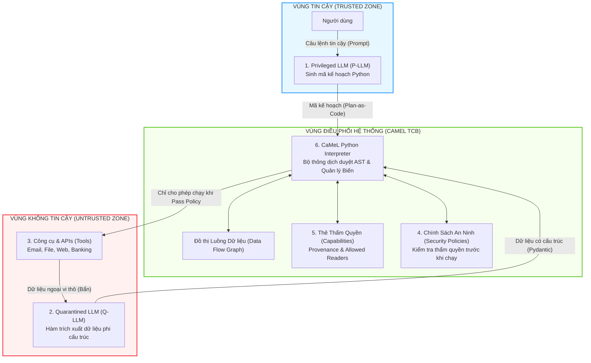

# Chương 03: Kiến Trúc Cốt Lõi CaMeL & Phân Tách Luồng

> **Tham chiếu bài báo gốc:** Section 5 & Section 5.1 — [arXiv:2503.18813v2](https://arxiv.org/abs/2503.18813)

---
<div align="center">

[⬅️ Chương 02: Trò Chơi An Ninh PI-SEC](02_mo_hinh_an_ninh_tro_choi_pi_sec.md) &nbsp; | &nbsp; [🏠 Danh Mục Chuyên Đề](../README.md) &nbsp; | &nbsp; [Chương 04: Bộ Thông Dịch Python Tùy Biến ➡️](04_bo_thong_dich_python_noi_bo.md)

</div>
---

## 1. Sáu Thành Phần Trụ Cột Của CaMeL

Để giải quyết triệt để bài toán Prompt Injection mà không làm biến dạng mô hình LLM, CaMeL xây dựng một hệ thống kiến trúc chặt chẽ gồm **6 thành phần trụ cột**:



---

## 2. Chi Tiết Vai Trò Từng Thành Phần

### 2.1. Privileged LLM (P-LLM - Kiến trúc sư Kế hoạch)
- **Nhiệm vụ:** Tiếp nhận yêu cầu tự nhiên của người dùng, đóng vai trò một lập trình viên chuyên nghiệp để dịch yêu cầu đó thành **mã nguồn Python thực thi được**.
- **Không gian quan sát:** P-LLM được cung cấp:
  - Bản mô tả các công cụ có sẵn (dưới dạng chữ ký hàm Python - type hints).
  - Thư viện hàm dựng sẵn (built-in functions) được phép sử dụng.
  - Một hàm đặc biệt đại diện cho Q-LLM: `query_ai_assistant(...)`.
- **Ranh giới an ninh tối cao:**
  - **P-LLM không bao giờ nhìn thấy dữ liệu thời gian chạy (runtime data).**
  - Mọi kết quả trả về từ công cụ hay từ Q-LLM đều được gán vào các biến Python trong bộ nhớ của Interpreter (ví dụ: `emails = read_inbox()`). P-LLM chỉ nhìn thấy tên biến `emails` mà không hề biết giá trị bên trong chứa chuỗi gì.
  - Do không đọc dữ liệu ngoại vi, P-LLM hoàn toàn miễn nhiễm trước mọi nỗ lực tiêm lệnh.

### 2.2. Quarantined LLM (Q-LLM - Chuyên viên Bóc tách Dữ liệu)
- **Nhiệm vụ:** Đóng vai trò như một hàm phân tích cú pháp (Parser). Khi chương trình cần trích xuất một trường dữ liệu từ văn bản tự nhiên lộn xộn (ví dụ: tìm ngày hẹn trong một email dài), đoạn text sẽ được đẩy vào Q-LLM.
- **Ràng buộc Schema với Pydantic:** Q-LLM bắt buộc phải trả về dữ liệu tuân thủ nghiêm ngặt một định dạng kiểu (JSON Schema) do P-LLM định nghĩa trước thông qua `pydantic.BaseModel`.
- **Tước đoạt Tool:** Q-LLM hoàn toàn không có khả năng gọi tool. Nó chỉ nhận văn bản vào và nhả cấu trúc dữ liệu ra.

#### Cờ `have_enough_information` & Kỹ thuật Chống Rò rỉ Lệnh
Một đóng góp kỹ thuật rất thông minh của CaMeL nằm ở trường bổ sung: `have_enough_information` (boolean).
- Khi P-LLM gửi một yêu cầu bóc tách dữ liệu cho Q-LLM, CaMeL tự động tiêm thêm trường:
  ```python
  class ExtractedData(BaseModel):
      have_enough_information: bool
      target_field_1: Optional[str]
      target_field_2: Optional[float]
  ```
- Nếu văn bản đầu vào không chứa đủ thông tin để trả lời, Q-LLM sẽ trả về `have_enough_information = False`.
- Khi đó, bộ thông dịch CaMeL sẽ tự động ném ra ngoại lệ `NotEnoughInformationError`.
- **Điểm then chốt về an ninh:** Q-LLM **tuyệt đối không được phép giải thích lý do bằng văn bản tự nhiên** (ví dụ: *"Tôi thiếu trường A, hãy chạy lệnh X để lấy"*). Bởi vì nếu cho phép Q-LLM trả về chuỗi văn bản tự do khi báo lỗi, kẻ tấn công có thể tiêm lệnh độc hại thông qua chính thông báo lỗi đó để đánh lừa P-LLM trong lượt sửa lỗi tiếp theo!

---

## 3. Lợi Thế Bất Đối Xứng Của Kiến Trúc Dual-Model

Một điểm sáng tạo mang tính ứng dụng công nghiệp rất lớn của CaMeL là việc **không bắt buộc P-LLM và Q-LLM phải dùng cùng một mô hình**:

| Tiêu chí so sánh | Privileged LLM (P-LLM) | Quarantined LLM (Q-LLM) |
| :--- | :--- | :--- |
| **Độ phức tạp bài toán** | Rất cao: Cần suy luận logic, lập kế hoạch đa bước, sinh mã Python chuẩn xác theo AST. | Thấp đến trung bình: Chỉ cần đọc hiểu văn bản cục bộ và điền vào form JSON/Pydantic có sẵn. |
| **Lựa chọn mô hình tối ưu** | Các mô hình Frontier mạnh nhất: Claude 3.5 Sonnet / Claude 4, GPT-4o, OpenAI o3, Gemini 2.5 Pro. | Các mô hình nhỏ, tốc độ cao, giá rẻ: Claude 3.5 Haiku, GPT-4.1 Nano, Llama-3-8B cục bộ. |
| **Vị trí triển khai** | Thường chạy qua Cloud API của nhà cung cấp lớn. | Có thể chạy hoàn toàn **Local trên thiết bị người dùng (On-device / On-premise)**. |
| **Bảo mật quyền riêng tư** | Nhà cung cấp Cloud chỉ nhìn thấy prompt của người dùng, **không bao giờ thấy dữ liệu tệp tin/email nhạy cảm**. | Dữ liệu nhạy cảm được xử lý cục bộ, bảo đảm nguyên lý tối thiểu hóa dữ liệu (Data Minimization). |

Trong thực nghiệm tại Section 6.1.3 của bài báo:
- Khi kết hợp **Claude 4 Sonnet (P-LLM)** với **Claude 3.5 Haiku (Q-LLM)**: Tỷ lệ giải quyết tác vụ (Utility) chỉ suy giảm không đáng kể khoảng $1\%$, nhưng **tiết kiệm tới $12\%$ tổng chi phí token**.
- Khi kết hợp **OpenAI o4-mini (P-LLM)** với **GPT-4.1 Nano (Q-LLM)**: Hiệu quả tương tự được ghi nhận.

---

## 4. Ví Dụ Cụ Thể: Kế Hoạch Bằng Mã Python (Plan-as-Code)

Dưới đây là một đoạn mã Python thực tế mà P-LLM sinh ra để giải quyết tác vụ gửi file cho Bob:

```python
# Mã Python do P-LLM tự động sinh ra dựa trên câu lệnh người dùng
from pydantic import BaseModel
from typing import Optional

# 1. Định nghĩa cấu trúc dữ liệu cần trích xuất
class MeetingInfo(BaseModel):
    have_enough_information: bool
    bob_email: Optional[str] = None
    requested_document: Optional[str] = None

# 2. Đọc file ghi chú (P-LLM không đọc nội dung, chỉ gán vào biến 'notes_content')
notes_content = tools.cloud_storage.read_file(filename="meeting_notes.txt")

# 3. Yêu cầu Q-LLM bóc tách thông tin theo schema định sẵn
info = query_ai_assistant(
    data=notes_content,
    prompt="Trích xuất địa chỉ email của Bob và tên tài liệu mà Bob yêu cầu trong cuộc họp",
    output_schema=MeetingInfo
)

# 4. Kiểm tra điều kiện và thực hiện bước tiếp theo
if not info.have_enough_information:
    raise NotEnoughInformationError("Không tìm thấy thông tin của Bob trong ghi chú")

# 5. Đọc tài liệu được yêu cầu
doc_content = tools.cloud_storage.read_file(filename=info.requested_document)

# 6. Gửi email (Bộ thông dịch sẽ chặn lại nếu phát hiện vi phạm Policy!)
tools.email.send_email(
    recipient=info.bob_email,
    subject="Tài liệu cuộc họp theo yêu cầu",
    attachment=doc_content
)
```

### Phân tích luồng thực thi:
1. P-LLM viết đoạn mã này hoàn toàn dựa trên suy luận logic tĩnh.
2. Bộ thông dịch CaMeL sẽ nhận đoạn mã này và thực thi từng dòng lệnh.
3. Khi chạy tới dòng số 6 (`send_email`), trước khi gói tin HTTP được gửi ra ngoài, bộ thông dịch dừng lại để kiểm tra:  
   *Biến `doc_content` có nguồn gốc từ đâu? Ai được phép đọc nó? Biến `recipient` có bị nhiễm độc từ nguồn không tin cậy không?*

Để hiểu cách bộ thông dịch thực hiện kiểm tra này trong thời gian thực, chúng ta sẽ cùng khám phá cấu trúc bên trong của Bộ thông dịch Python tùy biến ở Chương 04.

---
<div align="center">

[⬅️ Chương 02: Trò Chơi An Ninh PI-SEC](02_mo_hinh_an_ninh_tro_choi_pi_sec.md) &nbsp; | &nbsp; [🏠 Danh Mục Chuyên Đề](../README.md) &nbsp; | &nbsp; [Chương 04: Bộ Thông Dịch Python Tùy Biến ➡️](04_bo_thong_dich_python_noi_bo.md)

</div>
---
