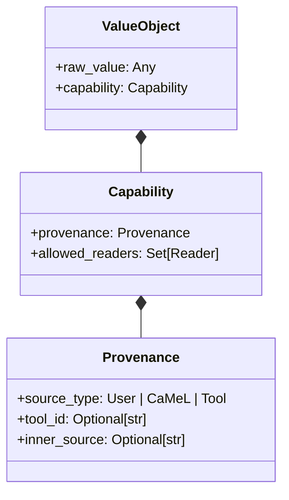

# Chương 05: Hệ Thống Thẻ Thẩm Quyền (Capabilities) & Chính Sách An Ninh

> **Tham chiếu bài báo gốc:** Section 5.2, Section 5.3 & Appendix E — [arXiv:2503.18813v2](https://arxiv.org/abs/2503.18813)

---
<div align="center">

[⬅️ Chương 04: Bộ Thông Dịch Python Tùy Biến](04_bo_thong_dich_python_noi_bo.md) &nbsp; | &nbsp; [🏠 Danh Mục Chuyên Đề](../README.md) &nbsp; | &nbsp; [Chương 06: Đồ Thị Luồng: NORMAL vs STRICT ➡️](06_do_thi_luong_du_lieu_normal_vs_strict.md)

</div>
---

## 1. Nguồn Gốc Khái Niệm Thẻ Thẩm Quyền (Capability)

Trong lịch sử khoa học máy tính, cơ chế kiểm soát truy cập truyền thống thường sử dụng **Danh sách Kiểm soát Truy cập (Access Control Lists - ACL)**: Gắn vào mỗi tệp tin một danh sách người dùng được phép đọc/ghi. Tuy nhiên, mô hình ACL bộc lộ điểm yếu lớn trong môi trường động khi dữ liệu liên tục được luân chuyển, biến đổi qua các tiến trình.

Để khắc phục, ngành an ninh phần mềm đã phát triển mô hình **Bảo mật dựa trên Thẩm quyền (Capability-based Security)**, tiêu biểu qua các dự án nổi tiếng như **Capsicum** (FreeBSD), **libcap** (Linux), và kiến trúc phần cứng **CHERI** (Cambridge/ARM).

> **Định nghĩa:** Một **Thẻ Thẩm Quyền (Capability)** là một siêu dữ liệu (metadata) không thể làm giả, được gắn chặt vào chính đối tượng dữ liệu. Bất kỳ tiến trình nào muốn thực hiện một thao tác lên dữ liệu đó đều phải xuất trình được thẻ thẩm quyền hợp lệ cho phép hành động đó.

CaMeL đã lần đầu tiên đưa nguyên lý này vào thế giới AI Agent: **Mỗi giá trị biến số trong bộ nhớ (dù là chuỗi ký tự, con số, hay mảng) đều được gán một Thẻ Thẩm Quyền đi kèm suốt vòng đời của nó.**

---

## 2. Cấu Trúc Metadata Của Một Capability Trong CaMeL

Một Thẻ Thẩm Quyền trong CaMeL bao gồm hai thành phần cốt lõi:



### 2.1. Nguồn Gốc Dữ Liệu (Provenance)
Ghi lại chính xác nguồn cội nơi biến số được sinh ra:
1. **`User` (Người dùng):** Toàn bộ các giá trị hằng số (literals) xuất hiện trực tiếp trong mã nguồn do P-LLM sinh ra từ prompt của người dùng. Đây là nguồn dữ liệu có độ tin cậy cao nhất.
2. **`CaMeL` (Hệ thống nội bộ):** Các giá trị được sinh ra từ các phép toán biến đổi nội bộ của bộ thông dịch (ví dụ: kết quả của phép nối chuỗi, phép tính cộng trừ).
3. **`Tool` (Công cụ ngoại vi):** Dữ liệu trả về từ một API bên ngoài, đi kèm mã định danh duy nhất của công cụ (`tool_id`).
4. **`Inner Source` (Nguồn gốc chi tiết bên trong công cụ):** Các công cụ thông minh có thể cung cấp thêm ngữ cảnh nguồn gốc. Ví dụ: Tool `read_email` sẽ gắn thẻ nguồn gốc chi tiết là địa chỉ email của người gửi (`sender_email`). Tool `cloud_storage` gắn thẻ nguồn gốc là danh sách người đã chỉnh sửa file (`document_editors`).

### 2.2. Độc Giả Hợp Lệ (Allowed Readers)
Quy định rõ những thực thể nào trong thế giới thực được phép tiếp cận và đọc nội dung của giá trị này:
- **`Public` (Công khai):** Dữ liệu không nhạy cảm, bất kỳ ai cũng có thể đọc (ví dụ: thông tin thời tiết, tin tức công cộng, trang Wikipedia).
- **`Set[User]` (Tập hợp người dùng cụ thể):** Danh sách các cá nhân (thường được định danh bằng địa chỉ email hoặc User ID) có quyền xem dữ liệu (ví dụ: `{"alice@company.com", "bob@company.com"}`).

---

## 3. Tại Sao Luồng Dữ Liệu (Data Flow) Là Chưa Đủ Nếu Thiếu Capabilities?

Hãy xét một ví dụ thực tế rất đắt giá được nêu trong bài báo (Section 5.3):
Một trợ lý AI được tích hợp công cụ đặt bàn ăn nhà hàng (`book_restaurant`).

- Công cụ này cần nhận vào các thông tin định danh cá nhân (PII) như: **Họ tên** và **Số điện thoại** của người dùng để nhà hàng liên hệ.
- Tuy nhiên, hệ thống còn lưu trữ những dữ liệu PII cực kỳ nhạy cảm khác như: **Số Hộ chiếu (Passport Number)** hoặc **Mã số Thuế / Số An sinh Xã hội (SSN)**.

Nếu chỉ sử dụng bộ kiểm tra luồng dữ liệu thô (Coarse-grained Data Flow):
- Hoặc hệ thống sẽ cấm toàn bộ dữ liệu PII đi vào công cụ đặt bàn $\rightarrow$ **Tác vụ thất bại (Mất Utility)**, Agent không thể đặt bàn giúp người dùng.
- Hoặc hệ thống sẽ cho phép dữ liệu PII đi vào công cụ đặt bàn $\rightarrow$ **Kẻ tấn công có thể tiêm lệnh để lấy cắp Số Hộ chiếu gửi tới nhà hàng!**

**Giải pháp nhờ Capabilities:**
- Giá trị Số Hộ chiếu được gắn thẻ: `allowed_readers = {"government_agency"}`.
- Giá trị Số Điện thoại được gắn thẻ: `allowed_readers = Public` hoặc `allowed_readers = {"service_providers"}`.
- Khi công cụ `book_restaurant` chuẩn bị chạy: Chính sách kiểm tra thẻ quyền sẽ cho phép Số Điện thoại đi qua, nhưng lập tức chặn đứng nếu phát hiện Số Hộ chiếu bị truyền vào tham số.

---

## 4. Chính Sách An Ninh (Security Policies) Trong Thực Tế

Trong CaMeL, Chính Sách An Ninh không phải là một chuỗi regex hay một ngôn ngữ DSL phức tạp khó bảo trì. **Chính sách an ninh được viết trực tiếp bằng các hàm Python thuần túy**, nhận vào tên công cụ, danh sách tham số và trạng thái bộ nhớ để đưa ra phán quyết:

```python
# Cấu trúc kết quả trả về của một chính sách an ninh trong CaMeL
class SecurityPolicyResult:
    def __init__(self, allowed: bool, reason: str = ""):
        self.allowed = allowed
        self.reason = reason
```

### 4.1. Case Study 1: Chính Sách Lịch Họp (Calendar Policy)
Dưới đây là mã nguồn mô phỏng chính sách an ninh cho công cụ tạo sự kiện lịch (`create_calendar_event`):

```python
def calendar_policy(tool_name: str, args: dict, mem: dict) -> SecurityPolicyResult:
    if tool_name != "create_calendar_event":
        return SecurityPolicyResult(allowed=True)
        
    title = args.get("title")
    description = args.get("description")
    participants = args.get("participants", [])
    
    # 1. Kiểm tra nguồn gốc của danh sách người tham gia
    # Nếu danh sách người tham gia đến trực tiếp từ người dùng tin cậy (User), cho phép tạo
    if all(p.capability.provenance.source_type == "User" for p in participants):
        return SecurityPolicyResult(allowed=True, reason="Người tham gia được chỉ định trực tiếp từ User.")
        
    # 2. Nếu người tham gia đến từ nguồn không tin cậy (ví dụ: trích xuất từ một email lạ):
    # Dữ liệu trong tiêu đề và mô tả cuộc họp BẮT BUỘC phải là Public hoặc
    # mọi người tham gia phải nằm trong danh sách Allowed Readers của nội dung đó
    event_data = [title, description]
    for data in event_data:
        for p in participants:
            if not data.capability.is_readable_by(p.email):
                return SecurityPolicyResult(
                    allowed=False, 
                    reason=f"Từ chối: Dữ liệu cuộc họp chứa thông tin mà người tham gia {p.email} không có quyền đọc!"
                )
                
    return SecurityPolicyResult(allowed=True)
```

### 4.2. Case Study 2: Chính Sách Chuyển Tiền Ngân Hàng (Banking Policy)
Trong bộ tác vụ Ngân hàng của AgentDojo, công cụ `send_money` đòi hỏi mức độ nghiêm ngặt cao nhất:
- **Người nhận tiền (`recipient`)** và **Số tiền (`amount`)** bắt buộc phải có nguồn gốc trực tiếp từ `User`.
- Đồ thị phụ thuộc của cả hai biến này **tuyệt đối không được chứa bất kỳ nút cha nào xuất phát từ nguồn ngoại vi không tin cậy**.
- Nhờ chính sách này, mọi nỗ lực của kẻ tấn công nhằm chèn thông tin chuyển tiền vào tệp hóa đơn hay email đều bị hệ thống phát hiện và chặn đứng $100\%$.

---

## 5. Cơ Chế Thẩm Quyền Tự Động Lan Truyền (Capability Propagation)

Khi chương trình thực thi các phép tính, Thẻ Thẩm Quyền được kế thừa và lan truyền theo các quy tắc toán học bảo toàn an ninh:

1. **Phép hợp nguồn gốc (Provenance Union):** Nếu $c = a + b$, thì nguồn gốc của $c$ là tập hợp hợp của nguồn gốc $a$ và nguồn gốc $b$:
   $$\text{Provenance}(c) = \text{Provenance}(a) \cup \text{Provenance}(b)$$
2. **Giao quyền đọc (Allowed Readers Intersection):** Người được phép đọc $c$ chỉ có thể là những người có quyền đọc **cả** $a$ và $b$:
   $$\text{AllowedReaders}(c) = \text{AllowedReaders}(a) \cap \text{AllowedReaders}(b)$$

Nguyên tắc này bảo đảm rằng: **Chỉ cần một biến bị pha tạp bởi một mẩu dữ liệu bí mật, toàn bộ các biến phái sinh từ nó sẽ tự động bị nâng mức bảo vệ lên mức cao nhất.**

---

*Chương tiếp theo sẽ đi sâu vào cách thức Bộ thông dịch CaMeL xây dựng Đồ thị Luồng Dữ liệu (Data Flow Graph) và so sánh sự khác biệt sống còn giữa hai chế độ: NORMAL Mode vs STRICT Mode.*

---
<div align="center">

[⬅️ Chương 04: Bộ Thông Dịch Python Tùy Biến](04_bo_thong_dich_python_noi_bo.md) &nbsp; | &nbsp; [🏠 Danh Mục Chuyên Đề](../README.md) &nbsp; | &nbsp; [Chương 06: Đồ Thị Luồng: NORMAL vs STRICT ➡️](06_do_thi_luong_du_lieu_normal_vs_strict.md)

</div>
---
