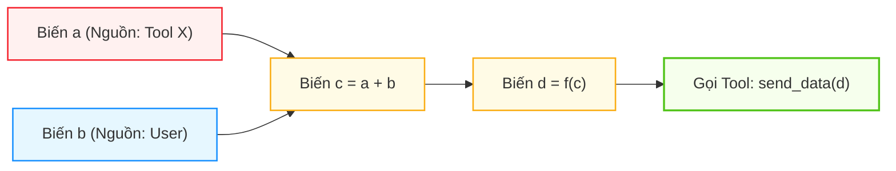
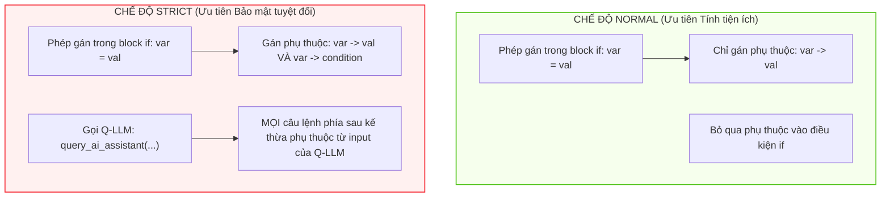

# Chương 06: Đồ Thị Luồng Dữ Liệu & So Sánh NORMAL vs STRICT Mode

> **Tham chiếu bài báo gốc:** Section 5.4.2 & Appendix D — [arXiv:2503.18813v2](https://arxiv.org/abs/2503.18813)

---

## 1. Duy Trì Đồ Thị Luồng Dữ Liệu (Data Flow Graph - DFG)

Trong suốt quá trình diễn dịch mã Python do P-LLM sinh ra, bộ thông dịch CaMeL liên tục xây dựng và cập nhật một **Đồ thị Có hướng Không chu trình (DAG)** biểu diễn các mối quan hệ phụ thuộc giữa các biến số, gọi là **Đồ thị Luồng Dữ liệu (Data Flow Graph)**.



Khi một biến $d$ được truyền vào làm đối số của một công cụ ngoại vi, bộ thông dịch sẽ duyệt đệ quy ngược từ $d$ về tất cả các nút tổ tiên trong DFG:
- Nếu phát hiện trong phả hệ của $d$ có chứa biến $a$ (vốn xuất phát từ một nguồn không tin cậy hoặc mang nhãn độc giả bị hạn chế), hệ thống sẽ đối soát với Chính sách An ninh để quyết định cho phép hoặc chặn đứng.

Tuy nhiên, một bài toán nan giải xuất hiện khi chương trình sử dụng các cấu trúc rẽ nhánh điều khiển (`if/else`) và vòng lặp (`for/while`).

---

## 2. Thách Thức Từ Các Cấu Trúc Điều Khiển: Rò Rỉ Thông Tin Gián Tiếp

Hãy xem xét đoạn mã Python kinh điển sau:

```python
# Giả sử 'is_vip_customer' là một dữ liệu tuyệt mật lấy từ ngân hàng
is_vip_customer = check_bank_database(user_id) 

discount_code = "STANDARD_10"
if is_vip_customer:
    discount_code = "VIP_90"

# Gửi mã giảm giá cho bên thứ ba
tools.marketing.send_promo(code=discount_code)
```

Nếu một bộ theo dõi luồng dữ liệu chỉ nhìn vào các phép gán thuần túy:
- Dòng gán: `discount_code = "VIP_90"` chỉ phụ thuộc vào chuỗi hằng số `"VIP_90"`.
- Chuỗi `"VIP_90"` là một hằng số trong code $\rightarrow$ Bộ thông dịch ngây thơ sẽ kết luận: *Biến `discount_code` là hoàn toàn an toàn và công khai!*
- Nhưng trong thực tế, giá trị của `discount_code` có bằng `"VIP_90"` hay không lại phụ thuộc trực tiếp vào biến bí mật `is_vip_customer`!
- Kẻ tấn công bên ngoài khi nhận được mã `"VIP_90"` có thể **suy diễn ngược lại $100\%$ rằng khách hàng này là VIP**. Đây chính là hiện tượng **Rò rỉ Thông tin Gián tiếp qua Luồng Điều khiển (Implicit Information Leak via Control Flow)**.

Để giải quyết vấn đề này, CaMeL cung cấp hai chế độ thực thi: **NORMAL Mode** và **STRICT Mode**.

---

## 3. So Sánh Chi Tiết: NORMAL Mode vs STRICT Mode



### 3.1. Chế độ NORMAL (Chế độ Tiêu chuẩn)
- **Cơ chế:** Chỉ theo dõi các mối quan hệ phụ thuộc dữ liệu trực tiếp trong biểu thức toán học và phép gán giá trị. Biến điều kiện của câu lệnh `if` không tự động truyền vào các biến được gán bên trong thân hàm `if`.
- **Ưu điểm:**
  - Giữ được tỷ lệ thành công của tác vụ (Utility) rất cao.
  - Tránh hiện tượng "nhiễm độc giả tạo" (Over-tainting), không làm phiền người dùng bởi các thông báo cảnh báo nhầm (False Positives).
- **Hạn chế:** Dễ bị tổn thương trước các đòn tấn công kênh phụ tinh vi (Side-channel attacks) hoặc rò rỉ thông tin qua rẽ nhánh.

### 3.2. Chế độ STRICT (Chế độ Nghiêm ngặt)
- **Cơ chế 1 - Kế thừa điều kiện rẽ nhánh:** Mọi biến số được khởi tạo hoặc gán lại bên trong một khối `if condition:` hoặc `for item in iterable:` sẽ tự động nhận thêm biến `condition` (hoặc `iterable`) làm nút cha trực tiếp trong Đồ thị Phụ thuộc DFG.
- **Cơ chế 2 - Cô lập sau lời gọi Q-LLM:** Bất cứ khi nào xuất hiện một lời gọi tới Quarantined LLM (`query_ai_assistant`), **toàn bộ các câu lệnh thực thi tiếp theo trong chương trình** đều tự động kế thừa mối quan hệ phụ thuộc vào các tham số đầu vào của lời gọi Q-LLM đó.
- **Ưu điểm:** Bảo vệ hệ thống toàn diện trước các đòn tấn công kênh phụ tinh vi, chặn đứng việc suy diễn dữ liệu mật qua ngoại lệ hoặc qua số lần lặp.
- **Hạn chế:** Hiện tượng Over-tainting có thể xảy ra: Một số biến vô hại nằm ở cuối chương trình có thể bị coi là "nguy hiểm", dẫn đến việc từ chối nhầm các hành động hợp lệ nếu chính sách quá khắt khe.

---

## 4. Bảng So Sánh Tổng Hợp

| Tiêu chí | NORMAL Mode | STRICT Mode |
| :--- | :--- | :--- |
| **Quy tắc gán trong `if cond:`** | `dep(var) = dep(expr)` | `dep(var) = dep(expr) ∪ dep(cond)` |
| **Quy tắc lặp `for x in list:`** | `dep(var) = dep(expr)` | `dep(var) = dep(expr) ∪ dep(list)` |
| **Sau lời gọi Q-LLM** | Các câu lệnh độc lập giữ nguyên phụ thuộc | Mọi câu lệnh phía sau kế thừa input của Q-LLM |
| **Khả năng chống Kênh phụ (Side-channel)** | Kém hơn (bị hở kênh suy diễn rẽ nhánh) | **Tuyệt đối (Chặn đứng mọi kênh suy diễn rẽ nhánh)** |
| **Tác động lên Utility (Tính tiện ích)** | Hầu như không suy giảm ($77\% - 84\%$) | Có thể làm tăng tỷ lệ hỏi xin xác nhận người dùng |
| **Khuyến nghị sử dụng** | Môi trường văn phòng thông thường (Workspace) | Môi trường tài chính, ngân hàng, quốc phòng |

Trong chương tiếp theo, chúng ta sẽ xem xét các kết quả thực nghiệm chi tiết trên benchmark AgentDojo để chứng minh hiệu quả thực tế của CaMeL.
