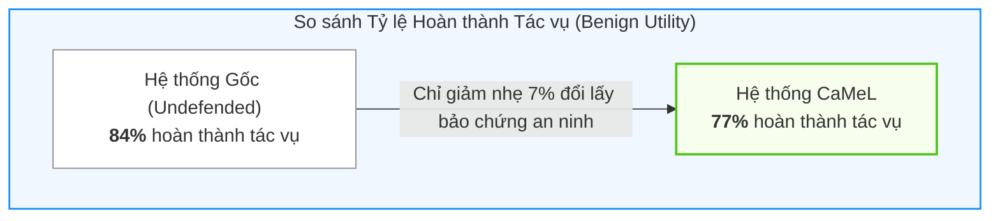
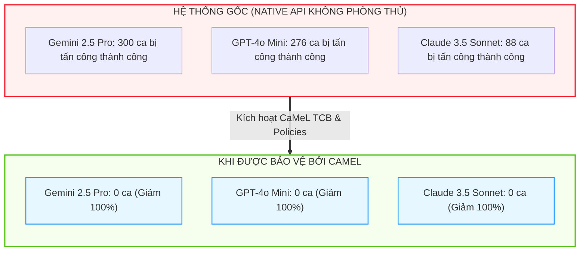

# Chương 07: Thực Nghiệm Chuyên Sâu Trên Benchmark AgentDojo

> **Tham chiếu bài báo gốc:** Section 6 & Appendix C, E, F, G — [arXiv:2503.18813v2](https://arxiv.org/abs/2503.18813)

---

[⬅️ Chương 06: Đồ Thị Luồng: NORMAL vs STRICT](06_do_thi_luong_du_lieu_normal_vs_strict.md) &nbsp; | &nbsp; [🏠 Danh Mục Chuyên Đề](../README.md) &nbsp; | &nbsp; [Chương 08: Tấn Công Kênh Phụ (Side-Channels) ➡️](08_phan_tich_kenh_phu_va_cac_don_tan_cong_nang_cao.md)

---

## 1. Giới Thiệu Benchmark Chuẩn AgentDojo

Để đánh giá toàn diện năng lực của CaMeL, nhóm tác giả đã thử nghiệm trên **AgentDojo** (Debenedetti et al., 2024) — bộ benchmark tiêu chuẩn hàng đầu thế giới về an ninh cho các hệ thống AI Agent có gọi công cụ.

AgentDojo bao gồm hàng trăm kịch bản thực tế được phân bố trên **4 miền tác vụ (Suites)**:
1. **Workspace:** Môi trường công sở (đọc/gửi email, quản lý tệp trên Google Drive / Cloud Storage, lên lịch hẹn trên Google Calendar).
2. **Banking:** Môi trường ngân hàng và tài chính (kiểm tra số dư, tra cứu lịch sử giao dịch, chuyển tiền qua tài khoản).
3. **Slack:** Môi trường trao đổi nhóm nội bộ (đọc tin nhắn kênh, gửi tin nhắn trực tiếp, tải nội dung từ web nội bộ).
4. **Travel:** Môi trường du lịch và dịch vụ (tìm kiếm chuyến bay, đặt phòng khách sạn, xem đánh giá người dùng).

Các mô hình ngôn ngữ lớn mạnh nhất thế giới tại thời điểm nghiên cứu đã được đưa vào thử nghiệm:
- **Họ mô hình Anthropic:** Claude 3.5 Haiku, Claude 3.5 Sonnet, Claude 4 Sonnet (có và không có reasoning tokens).
- **Họ mô hình OpenAI:** GPT-4.1, o4-mini, OpenAI o3.
- **Họ mô hình Google:** Gemini 2.5 Flash, Gemini 2.5 Pro.

---

## 2. Đánh Giá Tính Tiện Ích (Benign Utility Evaluation)

Một hệ thống an ninh dù an toàn đến đâu nhưng nếu làm tê liệt khả năng làm việc của AI thì cũng không thể đưa vào sản xuất. Câu hỏi đặt ra là: **CaMeL ảnh hưởng như thế nào đến khả năng hoàn thành công việc của mô hình trong điều kiện bình thường (không có tấn công)?**

### Kết quả nổi bật:
- **Tỷ lệ hoàn thành tác vụ tổng thể:** Hệ thống có CaMeL đạt **$77\%$**, chỉ giảm nhẹ $7\%$ so với hệ thống gốc không phòng thủ ($84\%$).
- Ở một số kịch bản, việc ép P-LLM phải tư duy theo cấu trúc lập trình Python chặt chẽ thậm chí còn giúp mô hình **hoạt động chính xác hơn** so với việc gọi function calling tự do truyền thống.

### Giải mã sự cố tại bộ tác vụ Travel (The Travel Suite Mystery):
Trong các thử nghiệm ban đầu với Claude 3.5 Sonnet, bộ tác vụ Travel ghi nhận mức sụt giảm Utility khá lớn (chỉ đạt $25\%$). Nhóm tác giả đã tiến hành giải phẫu nguyên nhân:
- **Nguyên nhân gốc rễ:** Không phải do kiến trúc CaMeL, mà do **tài liệu mô tả API (API Documentation) của bộ Travel trong AgentDojo quá sơ sài**. Cấu trúc JSON trả về của công cụ tìm chuyến bay không được ghi rõ kiểu dữ liệu. Vì P-LLM không được đọc dữ liệu thật nên nó không biết đường nào để viết code bóc tách.
- **Sự thích nghi kỳ diệu của các mô hình thế hệ mới:** Khi thử nghiệm với các mô hình suy luận mạnh hơn (Claude 3.7, Claude 4, OpenAI o3), các mô hình này tự động nhận ra rằng tài liệu API bị thiếu, và chúng tự động viết code ủy quyền cho Q-LLM làm nhiệm vụ phân tích cú pháp! Kết quả là Utility trên Travel suite tăng vọt từ **$25\%$ (Claude 3.5) $\rightarrow$ $55\%$ (Claude 3.7) $\rightarrow$ $75\%$ (Claude 4)** mà không cần sửa đổi bất kỳ dòng code nào trong lõi CaMeL!

---

## 3. Đánh Giá Khả Năng Phòng Thủ An Ninh (Security Evaluation)

Đây là nơi CaMeL thể hiện sự vượt trội mang tính áp đảo trước mọi giải pháp phòng thủ hiện có trên thế giới:

| Mô hình thử nghiệm | Số ca tấn công thành công (Không phòng thủ) | Số ca tấn công thành công (Bật CaMeL) | Tỷ lệ giảm thiểu |
| :--- | :---: | :---: | :---: |
| **Gemini 2.5 Pro** | **300 ca** | **0 ca** | **Giảm 100%** |
| **Claude 3.5 Sonnet** | **88 ca** | **0 ca** | **Giảm 100%** |
| **GPT-4o-mini (Native API)** | **276 ca** | **0 ca** | **Giảm 100%** |

### Tại sao GPT-4o-mini với Instruction Hierarchy vẫn bị hack 276 lần?
OpenAI đã tích hợp sẵn cơ chế phân tầng chỉ thị (Instruction Hierarchy) vào GPT-4o-mini để mô hình tự động phớt lờ lệnh từ tool. Tuy nhiên, trên AgentDojo, kẻ tấn công sử dụng các đòn bẻ khóa gián tiếp kết hợp logic điều hướng khiến mô hình nhầm lẫn giữa dữ liệu và mệnh lệnh, dẫn tới 276 lần rò rỉ dữ liệu hoặc thực thi lệnh trái phép. 

Khi đặt GPT-4o-mini vào bên trong khung CaMeL, **con số bị hack lập tức rớt về 0 tuyệt đối**, chứng minh rằng phòng thủ bằng kiến trúc hệ thống vượt trội hoàn toàn so với phòng thủ bằng huấn luyện mô hình.

---

## 4. Phân Tích Các Trường Hợp Thất Bại Điển Hình (Failure Modes)

Dựa trên phân tích pháp y chi tiết của tác giả đối với Claude 3.5 Sonnet (Appendix G & H), các nguyên nhân khiến tác vụ thất bại được phân nhóm như sau:

1. **"Data Requires Action" (Dữ liệu yêu cầu hành động):**  
   Ví dụ người dùng ra lệnh: *"Hãy làm theo các việc cần làm ghi trong email của David"*.  
   P-LLM chịu thua vì nó không được đọc email của David, nên nó không biết phải sinh mã gọi công cụ nào! Đây là giới hạn tự nhiên của mô hình phân tách. (Giải pháp tương lai là cung cấp cho P-LLM một công cụ đệ quy cấp dưới có chính sách kiểm soát riêng).
2. **"Not Enough Context for Q-LLM" (Thiếu ngữ cảnh cho Q-LLM):**  
   P-LLM yêu cầu Q-LLM tìm một thông tin mà trong tài liệu gốc thực sự không có. Q-LLM trả về `have_enough_information = False`, gây dừng chương trình.
3. **"Underdocumented API" (API thiếu tài liệu mô tả):**  
   P-LLM giả định sai cấu trúc trả về của công cụ dẫn đến phát sinh ngoại lệ cú pháp.

---

## 5. Đánh Đổi Về Chi Phí & Token Overhead

CaMeL bảo vệ an toàn bằng cách yêu cầu P-LLM sinh mã nguồn và đôi khi cần vòng lặp sửa lỗi (Feedback loop). Chi phí tính toán tăng thêm là bao nhiêu?

- **Input Tokens:** Tăng trung bình **$2.82\times$** so với gọi API thông thường (do prompt phải chứa thêm đặc tả ngôn ngữ Python rút gọn và danh sách công cụ).
- **Output Tokens:** Tăng trung bình **$2.73\times$** (do mô hình phải viết cả một khối mã nguồn Python hoàn chỉnh thay vì chỉ nhả ra một cấu trúc JSON ngắn).

> [!NOTE]
> Mặc dù chi phí token tăng khoảng gần 3 lần, nhóm tác giả khẳng định đây là một cái giá **hoàn toàn chấp nhận được** để đổi lấy **bảo chứng an ninh cấp hệ thống (Provable Security Guarantees)**, đặc biệt là trong các ứng dụng doanh nghiệp nhạy cảm nơi một vụ rò rỉ dữ liệu có thể gây thiệt hại hàng triệu đô la.

---

*Chương tiếp theo sẽ đưa chúng ta đến phần hấp dẫn nhất về mặt nghiên cứu an ninh: Các đòn tấn công Kênh phụ (Side-Channel Attacks) và cách kẻ tấn công cố gắng xuyên thủng CaMeL.*

---

[⬅️ Chương 06: Đồ Thị Luồng: NORMAL vs STRICT](06_do_thi_luong_du_lieu_normal_vs_strict.md) &nbsp; | &nbsp; [🏠 Danh Mục Chuyên Đề](../README.md) &nbsp; | &nbsp; [Chương 08: Tấn Công Kênh Phụ (Side-Channels) ➡️](08_phan_tich_kenh_phu_va_cac_don_tan_cong_nang_cao.md)

---
