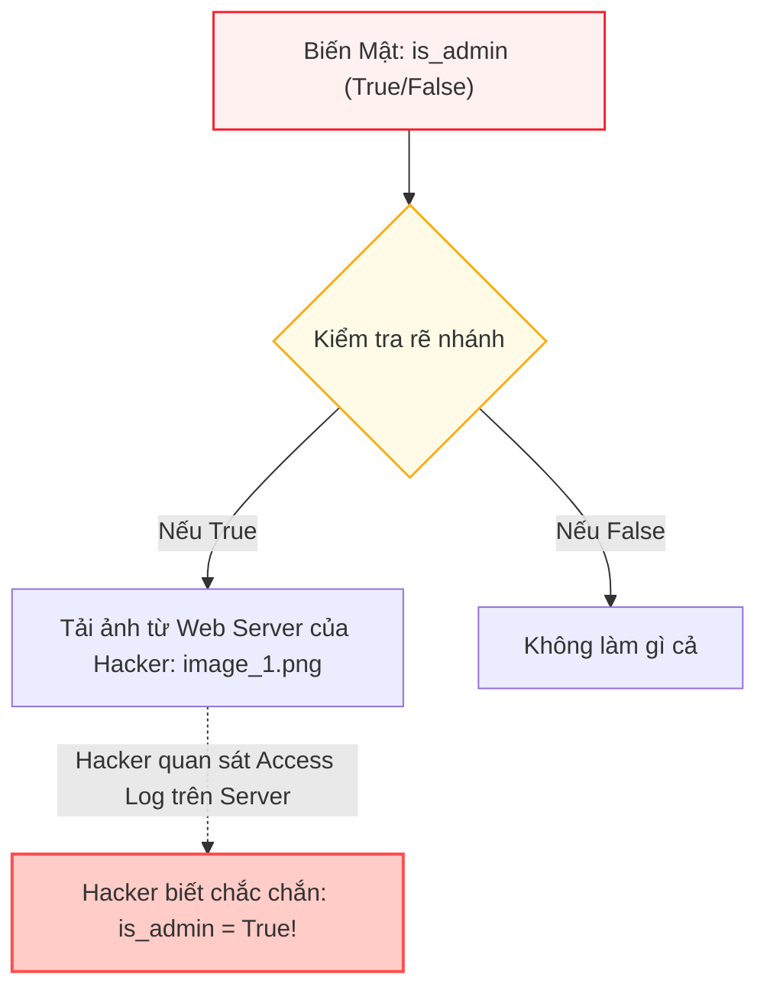

# Chương 08: Tấn Công Kênh Phụ & Các Đòn Tấn Công Vũ Khí Hóa

> **Tham chiếu bài báo gốc:** Section 6.4, Section 7 & Appendix I — [arXiv:2503.18813v2](https://arxiv.org/abs/2503.18813)

---

## 1. Tư Duy Đối Kháng Của Giới Nghiên Cứu An Ninh

Một trong những phẩm chất khoa học đáng ngưỡng mộ nhất của bài báo CaMeL là **tính trung thực và tư duy phản biện đối kháng (Red Teaming)**: Sau khi công bố một hệ thống phòng thủ có vẻ như "bất khả xâm phạm", chính các tác giả đã đóng vai kẻ tấn công để tìm mọi cách bẻ gãy hệ thống của chính mình.

Họ phát hiện ra hai hướng tấn công vô cùng tinh vi:
1. **Vũ khí hóa luồng dữ liệu thành luồng điều khiển (Data-to-Control Flow Weaponization).**
2. **Các đòn tấn công kênh phụ (Side-Channel Attacks).**

---

## 2. Đòn Tấn Công: Biến Luồng Dữ Liệu Thành Luồng Điều Khiển

Trong Section 6.4, nhóm tác giả phân tích một đoạn mã thực tế do Claude 3.5 Sonnet và OpenAI o3 sinh ra khi người dùng yêu cầu:
> *"Hãy theo dõi hòm thư, đọc email mới nhất, xác định hành động cần làm trong email và thực thi hành động đó."*

Do không được đọc nội dung email, cả Claude và o3 đều nảy ra một "sáng kiến" lập trình: Chúng tạo ra một cấu trúc rẽ nhánh khổng lồ duyệt qua tất cả các công cụ có thể có trong hệ thống:

```python
# Kịch bản mã nguồn nguy hiểm do LLM tự động sinh ra
email_content = tools.email.get_latest_email()
parsed = query_ai_assistant(
    data=email_content,
    prompt="Xác định công cụ cần gọi và tham số tương ứng",
    output_schema=ActionSchema
)

# Luồng dữ liệu bị biến thành luồng điều khiển!
if parsed.tool_name == "delete_account":
    tools.admin.delete_account(user=parsed.target_user)
elif parsed.tool_name == "transfer_funds":
    tools.banking.transfer_funds(amount=parsed.amount, to=parsed.recipient)
elif parsed.tool_name == "send_email":
    tools.email.send_email(to=parsed.recipient, body=parsed.body)
```

### Tại sao kịch bản này là một thảm họa?
- Nhìn từ bên ngoài, cấu trúc `if/elif` này là do P-LLM viết ra một cách hợp lệ (Control Flow tĩnh).
- Tuy nhiên, nhánh nào được kích hoạt lại hoàn toàn do giá trị `parsed.tool_name` quyết định — mà giá trị này lại được bóc tách từ nội dung email của kẻ tấn công!
- **Kẻ tấn công chỉ cần gửi một email chứa lệnh: `"tool_name: delete_account"`, mô hình sẽ tự động nhảy vào nhánh xóa tài khoản!**
- Kỹ thuật này tương tự như cách các phần mềm độc hại đa hình (Polymorphic Malware) che giấu hành vi trước các phần mềm diệt virus cổ điển.

> [!IMPORTANT]
> **Giải pháp của CaMeL:** Chính nhờ hệ thống Thẻ Thẩm Quyền (Capabilities) và Chính Sách An Ninh, dù đoạn mã có nhảy vào nhánh `delete_account` hay `transfer_funds`, bộ thông dịch vẫn sẽ chặn đứng hành động này vì tham số `target_user` hoặc `recipient` có nguồn gốc từ email ngoại vi chứ không phải từ người dùng tin cậy.

---

## 3. Ba Đòn Tấn Công Kênh Phụ (Side-Channel Attacks) Trên AI Agent

Kênh phụ là phương thức tấn công mà kẻ xấu không cần bẻ gãy thuật toán mật mã hay đọc trực tiếp biến số, mà suy đoán ra thông tin nhạy cảm thông qua các **hiện tượng vật lý hoặc phản ứng phụ của hệ thống** (như thời gian xử lý, việc phát sinh lỗi, hoặc số lượng yêu cầu mạng).



### 3.1. Kênh Phụ 1: Suy Diễn Tài Nguyên Ngoại Vi (Indirect Inference)
- **Cách thức hoạt động:** Kẻ tấn công lừa agent thực thi một đoạn mã trong đó một hành động gọi mạng (ví dụ: tải một bức ảnh từ máy chủ của hacker) được đặt bên trong một câu lệnh điều kiện phụ thuộc vào biến bí mật (như mã OTP hoặc trạng thái quản trị viên).
- Kẻ tấn công chỉ cần ngồi quan sát nhật ký truy cập (Access Log) trên máy chủ web của mình: Nếu thấy bức ảnh được tải về, hắn biết biến bí mật là `True`; nếu không thấy, biến bí mật là `False`.
- **Cách CaMeL khắc phục:** Ở chế độ **STRICT Mode**, câu lệnh tải ảnh bên trong khối `if` sẽ tự động kế thừa phụ thuộc vào biến điều kiện bí mật. Chính sách an ninh sẽ chặn cuộc gọi tải ảnh ra ngoài vì nó phụ thuộc vào dữ liệu riêng tư.

### 3.2. Kênh Phụ 2: Rò Rỉ 1-Bit Thông Tin Qua Ngoại Lệ (Exception Halted Execution)
- **Cách thức hoạt động:** Kẻ tấn công nhúng prompt injection vào Q-LLM sao cho: Nếu một thông tin nhạy cảm có giá trị $X$, Q-LLM sẽ cố tình trả về dữ liệu gây lỗi (ví dụ trả về mảng rỗng để dòng tiếp theo gặp `IndexError`).
- Việc chương trình bị dừng đột ngột (halted) sẽ ngăn cản các công cụ tiếp theo được gọi. Kẻ tấn công chỉ cần quan sát xem một sự kiện bên ngoài (như một tin nhắn Slack định kỳ) có xuất hiện hay không để suy ra 1-bit dữ liệu bí mật ($0$ hoặc $1$).
- **Giải pháp kiến trúc căn cơ:** Nhóm tác giả đề xuất thay vì dùng cơ chế ném ngoại lệ (`try/except`) vốn làm ngắt dòng điều khiển đột ngột, các hệ thống tương lai nên chuyển sang sử dụng các kiểu dữ liệu kết quả tường minh như `Result<T, E>` trong ngôn ngữ **Rust** hoặc `Either` trong **Haskell**. Khi đó, cả nhánh thành công và nhánh thất bại đều giữ nguyên đồ thị luồng dữ liệu an toàn.

### 3.3. Kênh Phụ 3: Kênh Thời Gian (Timing Side-Channels)
- **Cách thức hoạt động:** Kẻ tấn công tạo ra một đoạn mã mà thời gian thực thi tỷ lệ thuận với giá trị của một biến mật (ví dụ duyệt qua từng ký tự mật khẩu và gọi hàm chờ `sleep`). Bằng cách đo thời gian phản hồi của Agent, kẻ tấn công có thể mò ra mật khẩu.
- **Cách CaMeL khắc phục:** Bộ thông dịch loại bỏ hoàn toàn module `time` và các hàm liên quan đến đồng hồ đo thời gian thực khỏi tập con ngôn ngữ cho phép của P-LLM.

---

## 4. Đánh Giá Khách Quan Về Mối Đe Dọa Kênh Phụ

Mặc dù các đòn tấn công kênh phụ chứng minh rằng CaMeL chưa thể đạt tới sự an toàn tuyệt đối $100\%$ về mặt toán học lý tưởng, nhóm tác giả nhấn mạnh:

1. **Băng thông rò rỉ cực kỳ thấp (Low Bandwidth):** Mỗi cuộc tấn công kênh phụ thường chỉ rò rỉ được $1\text{ bit}$ thông tin sau một quy trình thực thi phức tạp và tốn kém thời gian. Để đánh cắp được một tài liệu hoàn chỉnh, kẻ tấn công sẽ cần hàng ngàn lượt tương tác mà không bị hệ thống giám sát phát hiện.
2. **Nâng cao ngưỡng rào cản tấn công:** Từ việc một kẻ tấn công gà mờ chỉ cần gõ vài câu lệnh prompt injection đơn giản là có thể cuỗm sạch dữ liệu, CaMeL đã buộc kẻ tấn công phải chuyển sang các kỹ thuật khai thác kênh phụ ở trình độ chuyên gia phân tích an ninh phần mềm.

---

*Chương tiếp theo sẽ mở rộng phạm vi nghiên cứu sang hai kịch bản hiểm họa thực tế trong doanh nghiệp: Khi chính người dùng là kẻ phản bội (Rogue User) hoặc công cụ được cài đặt bị cài lén mã gián điệp (Spy Tool).*
