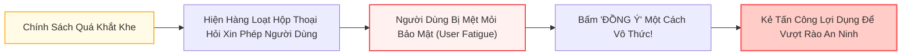

# Chương 10: Thảo Luận, Giới Hạn Thực Tế & Lộ Trình Tương Lai

> **Tham chiếu bài báo gốc:** Section 9, Section 10 & Section 11 — [arXiv:2503.18813v2](https://arxiv.org/abs/2503.18813)

---

## 1. Bài Học Lịch Sử: Rào Cản Triển Khai Hệ Thống Dựa Trên Thẩm Quyền

Mặc dù mô hình Thẩm quyền (Capability-based Security) mang lại bảo chứng an toàn toán học rất đẹp đẽ, lịch sử an ninh máy tính cho thấy việc đưa các hệ thống này vào thực tế thường gặp phải những trở ngại khổng lồ:

1. **Chi phí tái kiến trúc hệ sinh thái (Ecosystem Adoption Barrier):**
   - Bài học từ dự án phần cứng **CHERI** (Đại học Cambridge và ARM): Để hỗ trợ thẻ thẩm quyền ở tầng thanh ghi CPU, các kỹ sư đã phải viết lại toàn bộ trình biên dịch C/C++, chỉnh sửa nhân hệ điều hành FreeBSD, và thay đổi cách thức lập trình của hàng chục ngàn nhà phát triển.
   - Với AI Agent, để CaMeL phát huy tối đa sức mạnh, mọi dịch vụ API bên ngoài (Google Drive, Slack, Stripe, Salesforce) lý tưởng nhất đều phải hiểu và trả về các siêu dữ liệu thẩm quyền.
2. **Vai trò Trọng tài Tập trung (Central Authority):**
   - Trong ngắn hạn, khi các dịch vụ bên thứ ba chưa hỗ trợ capabilities, Agent phải đóng vai trò là cơ quan quyền lực trung tâm tự quản lý và gán nhãn thẩm quyền cho mọi đối tượng dữ liệu trong bộ nhớ nội bộ.

---

## 2. Thách Thức Trải Nghiệm Người Dùng: Hiện Tượng "Mệt Mỏi Bảo Mật" (User Fatigue)

Trong an ninh thông tin, bài toán khó nhất không nằm ở thuật toán, mà nằm ở **yếu tố con người (The Human Factor)**:

### Quá trình Hạ cấp Bí mật (De-classification):
Khi một chính sách an ninh phát hiện một hành động có nguy cơ rò rỉ dữ liệu (ví dụ: gửi một tệp nội bộ cho một email bên ngoài), hệ thống sẽ không tự ý chặn hoàn toàn mà chuyển sang xin ý kiến phê duyệt của người dùng:
> *"Tác tử đang chuẩn bị gửi tệp 'BaoCao.pdf' cho đối tác 'partner@corp.com'. Bạn có đồng ý giải phóng quyền truy cập cho tệp này không?"*

Nếu câu hỏi này xuất hiện quá thường xuyên:
- Người dùng sẽ rơi vào trạng thái **"Mệt mỏi Bảo mật" (Security / Alert Fatigue)** — tương tự như hiện tượng người dùng Windows thời kỳ đầu luôn bấm "Yes" vào mọi hộp thoại UAC (User Account Control), hoặc người dùng Android cấp toàn bộ quyền truy cập ứng dụng mà không cần đọc.
- Khi đó, kẻ tấn công chỉ cần kích hoạt một thông báo trông có vẻ bình thường, người dùng sẽ tự tay bấm "Đồng ý" và mở toang cánh cửa cho mã độc.

> [!TIP]
> **Bài học thiết kế:** Nghệ thuật xây dựng hệ thống Agent không phải là khóa chặt mọi thứ, mà là tối ưu hóa độ nhạy của chính sách: **Chỉ làm phiền người dùng ở những quyết định thực sự sống còn (High-stakes Decisions)**, còn các luồng dữ liệu an toàn thông thường phải được xử lý tự động và mượt mà.

---

## 3. Sự Tương Đồng Kỳ Lạ: Từ CFI/ROP Cổ Điển Đến Prompt Injection

Một phát hiện học thuật cực kỳ sâu sắc trong Section 9.3 là việc các tác giả so sánh cuộc chiến chống Prompt Injection với cuộc chiến chống lỗi bộ nhớ trong an ninh phần mềm 20 năm trước:

| Giai đoạn lịch sử | An ninh Hệ thống Cổ điển (C/C++) | An ninh Hệ thống AI Agent (LLM) |
| :--- | :--- | :--- |
| **Cuộc tấn công ban đầu** | **Buffer Overflow:** Ghi đè con trỏ lệnh (EIP/RIP) để nhảy tới shellcode của hacker. | **Direct / Indirect Prompt Injection:** Ghi đè prompt hệ thống để ép LLM thực thi lệnh độc. |
| **Phòng thủ thế hệ 1** | **Control Flow Integrity (CFI):** Kiểm tra đồ thị luồng điều khiển, cấm nhảy tới các địa chỉ lạ. | **Dual-LLM & CaMeL:** Cố định luồng điều khiển bằng P-LLM, ngăn kẻ tấn công thay đổi kế hoạch. |
| **Cuộc tấn công đáp trả** | **Return-Oriented Programming (ROP):** Kẻ tấn công không cần chèn mã mới, mà ghép nối các đoạn mã hợp lệ có sẵn (**Gadgets**) để tạo thành mã độc. | **Data Flow Weaponization (Section 6.4):** Kẻ tấn công không đổi kế hoạch, mà điều khiển dữ liệu để lần lượt kích hoạt các công cụ hợp lệ theo thứ tự phá hoại! |

Sự tương đồng này chứng minh một quy luật muôn thuở của ngành An ninh Thông tin: **Không có giải pháp nào là "viên đạn bạc" giải quyết dứt điểm mọi nguy cơ. An ninh là một quá trình liên tục nâng cao chi phí tấn công của đối thủ.**

---

## 4. Lộ Trình Nghiên Cứu Tương Lai (Future Work)

Nhóm tác giả vạch ra ba hướng nghiên cứu đột phá tiếp theo cho cộng đồng khoa học:

### 4.1. Thay Thế Python Bằng Ngôn Ngữ Hàm Có Định Kiểu Chặt Chẽ (Haskell / Rust)
- Ngôn ngữ Python tuy thân thiện nhưng chứa quá nhiều hiệu ứng phụ ngầm (side-effects) và cơ chế xử lý ngoại lệ lỏng lẻo.
- Nhóm tác giả đề xuất chuyển đổi ngôn ngữ kế hoạch của P-LLM sang các ngôn ngữ hàm an toàn như **Rust** hoặc **Haskell**.
- Nhờ hệ thống kiểu dữ liệu đại số (`Result<T, E>`), mọi trường hợp lỗi đều được mô hình hóa thành một nhánh dữ liệu tường minh, triệt tiêu hoàn toàn các đòn tấn công kênh phụ qua ngoại lệ (Exception-based Side Channels).

### 4.2. Kiểm Chứng Hình Thức (Formal Verification)
- Sử dụng các công cụ chứng minh định lý toán học (như Coq, Isabelle, Lean) để kiểm chứng hình thức rằng: **Bộ thông dịch CaMeL không chứa lỗi logic cài đặt** và các chính sách an ninh luôn bảo đảm tính bất biến (Safety Invariants) trong mọi trường hợp.

### 4.3. Tự Động Hóa Chính Sách Bằng Ngữ Cảnh Toàn Vẹn (Contextual Integrity & AirGap)
- Tích hợp các lý thuyết về Ngữ cảnh Toàn vẹn (Contextual Integrity của Helen Nissenbaum) kết hợp với các dự án như **AirGap** (Bagdasaryan et al., 2024) để hệ thống có thể **tự động suy luận ra chính sách an ninh phù hợp dựa trên ngữ cảnh công việc**, giảm bớt gánh nặng phải cấu hình thủ công cho con người.

---

## 5. Lời Kết: Tư Duy Kỹ Nghệ An Ninh Cho Tương Lai Trí Tuệ Nhân Tạo

Bài báo **"CaMeL: Defeating Prompt Injections by Design"** đã đánh dấu một bước ngoặt lịch sử trong cách chúng ta tư duy về an toàn AI:

1. **Từ bỏ ảo tưởng về một "Siêu mô hình không bao giờ bị lừa":** Bản chất xác suất của mạng nơ-ron khiến nó luôn tiềm ẩn điểm mù.
2. **Khẳng định sức mạnh của Kỹ nghệ Phần mềm:** Bằng cách bao bọc mô hình trong một kiến trúc hệ thống nghiêm ngặt (Dual-LLM, Custom Interpreter, Capabilities, Security Policies), chúng ta có thể xây dựng nên những hệ thống AI **an toàn tuyệt đối theo thiết kế (Secure by Design)** ngay trên nền những mô hình chưa hoàn hảo.
3. **Mở đường cho Agent cấp Doanh nghiệp:** Đây chính là nền móng kỹ thuật vững chắc để đưa AI Agent thâm nhập an toàn vào các lĩnh vực nhạy cảm nhất của nhân loại: ngân hàng, y tế, quản trị doanh nghiệp và an ninh quốc gia.

---

*Hết chuỗi chuyên đề 10 chương đọc hiểu paper CaMeL.*
